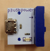
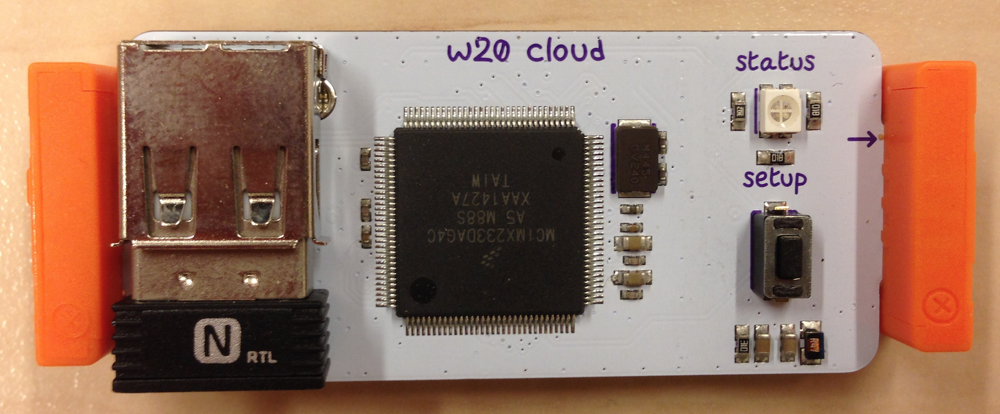
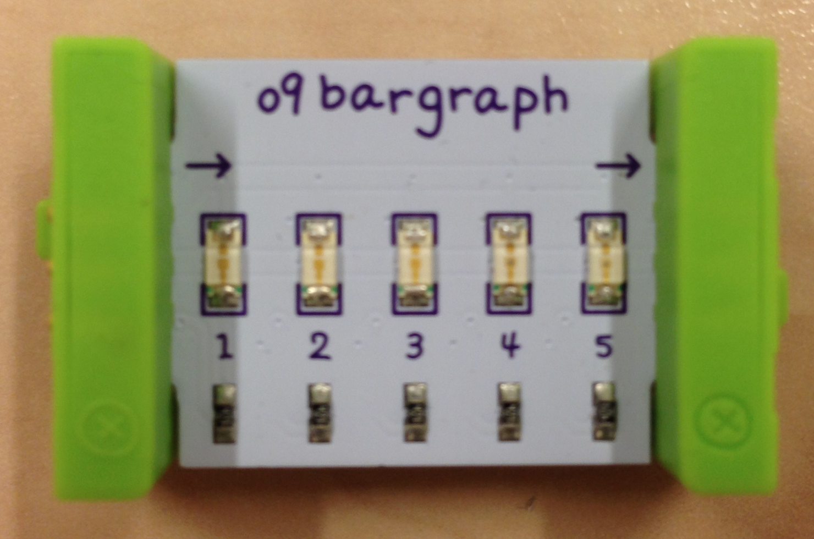
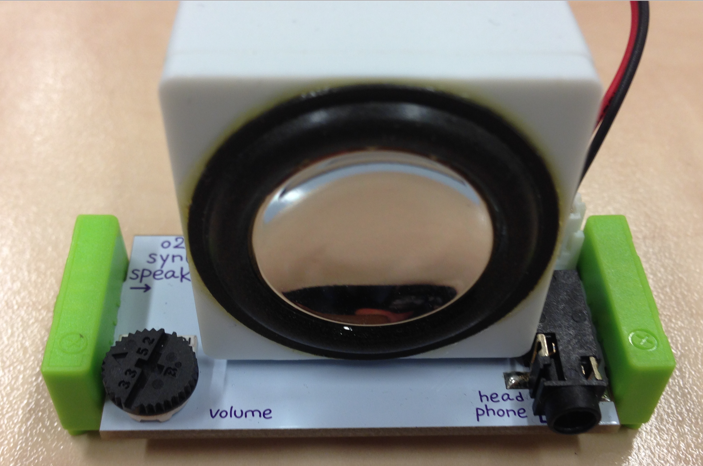
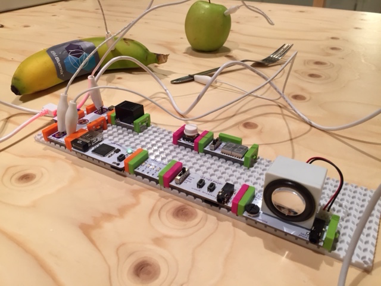

# How to connect your littleBits to Node-RED in IBM Bluemix
In this tutorial we describe how you can integrate your littleBits with the Node-RED environment in IBM Bluemix. It discusses the minimum that is needed to complete this integration. We have attached a sample flow that was used to create our tweeting and singing Bluemix banana.

## What do you need?
###### At least
* An IBM Bluemix account. If you don’t have one, please register for a free account at http://bluemix.net

* 
A littleBits USB input bit ( _p3 usb power_ ) + USB cable + power

*  A littleBits Cloudbit connector bit ( _w20 cloud_ )

*  A littleBits output bit ( _e.g. o9 bargraph_ )

###### Extra bits for the Banana sample flow
<p/>
*  A littleBits Makey Makey input bit ( _w14 makey makey_ ) + connectors

*  A littleBits Synth speaker output bit ( _o24 synth speaker_ ).

## Connect your Cloudbit to the littleBits cloud
The first step is to connect your Cloudbit to the LittleBits cloud, so that the Cloudbit is known to the littleBits cloud and can start to send and receive data.

Go to http://control.littlebitscloud.cc/ and sign in with your userid and password. First time visitors need to register first.

Once you’re logged in, click on ‘+ New Cloudbit’ and assign a name to your Cloudbit. Click ‘Save’ to complete this step and start the setup of your Cloudbit.

Follow Step 1 - 5 on the screen to complete the setup of your Cloudbit. If everything went fine, the Cloudbit’s status led should be green. This means the bit is connected to the littleBits cloud and is ready to send and receive data.

## Create a Node-RED environment in IBM Bluemix
The next step is to set up a Node-RED environment in IBM Bluemix. For this, click on the 'Deploy to Bluemix' button and follow the instructions.

[](https://bluemix.net/deploy?repository=https://hub.jazz.net/git/eciggaar/bluemixbanana )

A Node-RED environment will be created for you in IBM Bluemix and the tweeting and singing banana sample flow will be deployed for you.

### Create your Node-RED flow
Now both the Cloudbit and the Node-RED environment have been set up and configured, it is time to create your flow. For this flow to be capable of communicating with the littleBits Cloudbit, you need to be able to send and receive data from it.

###### Receiving data from the Cloudbit
One possible way of receiving data from the Cloudbit is to start your flow with a HTTP Input node. This node needs to be able to receive events that are sent by the Cloudbit. For this, you need to add your node as a subscriber to the Cloudbit. This is done via the following REST API call:
```
curl -X POST -H "Authorization: Bearer <your_access_token>" -H "Content-Type: application/json" -d '{"publisher_id": "<deviceid_cloudbit>","subscriber_id": “<subscriber_uri>"}' 'https://api-http.littlebitscloud.cc/v2/subscriptions'
```
where `<deviceid_cloudbit>` is the unique identifier of your Cloudbit and `<subscriber_id>` the URL of the subscribing HTTP input node. The `<access_token>` is your simple authentication token. Every REST call must have an Authorization header containing this token. It is listed under the ‘Settings’ of your registered Cloudbit on the littleBits Cloud Control site.

If the call was successful, you will get a response similar to:
```
{
  "publisher_id": "<deviceid_cloudbit>",
  "subscriber_id": "<subscriber_uri>",
  "publisher_events": [
    {
      "name": "amplitude:delta:ignite"
    }
  ]
}
```
To obtain a listing of subscribers to your Cloudbit, execute the following REST call:
```
curl -X GET -H "Authorization: Bearer <access_token>" 'https://api-http.littlebitscloud.cc/v2/subscriptions?publisher_id=<deviceid_cloudbit>'
```
Finally, the following call will remove your subscription from the Cloudbit:
```
curl -X DELETE -H "Authorization: Bearer <access_token>" -H "Content-Type: application/json" -d '{"publisher_id": "<deviceid_cloudbit>","subscriber_id": “<subscriber_uri>"}' 'https://api-http.littlebitscloud.cc/v2/subscriptions'
```
Only execute this call when your no longer wish to send your events to the Node-RED input node.

###### Sending data to the Cloudbit.
Now that we are able to receive events from our Cloudbit, let’s see how we can trigger the Cloudbit by sending a response. The REST call to send a message to the Cloudbit is as follows:
```
curl -X POST -H "Authorization: Bearer <access_token>" -H "Content-Type: application/json" -d '{"percent": "90","duration_ms": "5000"}' 'https://api-http.littlebitscloud.cc/v3/devices/<device_id>/output'
```
Important is to specify both the ‘Authorization’ and ‘Content-Type’ header. The body is just an example payload. Both values are optional. If they are not specified, 100% is used as the default value for the percentage and 3000 (ms) as the default value for the duration.

To translate the above REST call in Node-RED nodes, we need an HTTP output node and a function node. They need to be linked with the HTTP input node as illustrated below.

The HTTP output node contains the URL and the request method. In this case the URL would be:
```
http.littlebitscloud.cc/v3/devices/<device_id>/output
```
and the method is set to POST. Replace `<device_id>` with the actual value of your Cloudbit.
The function node is used to prepare the message body and the request headers. The implementation of the node is as follows.
```
// First store percent value of received message
percentage = msg.payload.percent;
msg={}; // Empty message for HTTP call to Cloudbit

console.log('percentage:' + percentage);

// Set headers for HTTP call to Cloudbit
msg.headers = {
    "Authorization" : "Bearer <access_token>",
    "Content-type" : "application/json"
};

// Set message body for HTTP call to Cloudbit
msg.body = {
  "percent": percentage,
  "duration_ms": "5000"
}

return msg;
```
### The tweeting and singing Banana sample flow
The Node-RED flow that is deployed as sample flow illustrates the integration described above. It receives events sent by the Cloudbit. Next, using an iterator — which is reset every day — it tweets how many times it has been invoked that day. Finally, it invokes the Cloudbit to trigger the next step in the littleBits set-up. In our example the Cloudbit triggered a bargraph bit (O9) for 5 seconds, followed by playing a song from the MP3 player bit (i25). Because the initial Cloudbit event was triggered by a Makey Makey bit (w14), connected to a banana, this makes our banana a tweeting and singing banana powered by littleBits and IBM Bluemix.
<p align="center">

</p>
Make sure that you modify the nodes to match your own values for the Cloudbit and twitter account.

*Have fun!!*
